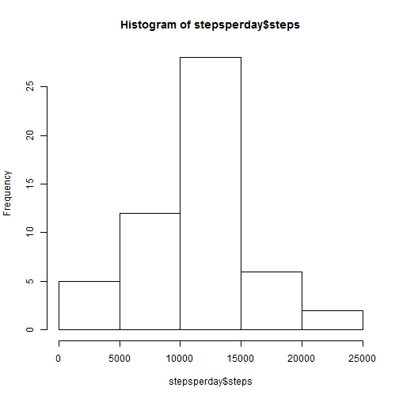
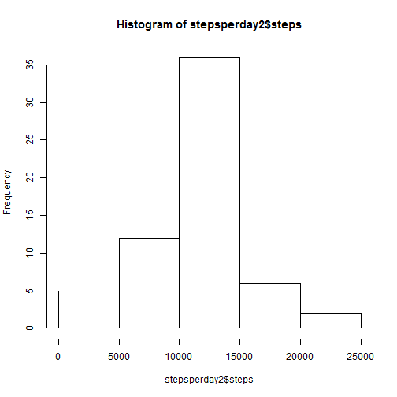
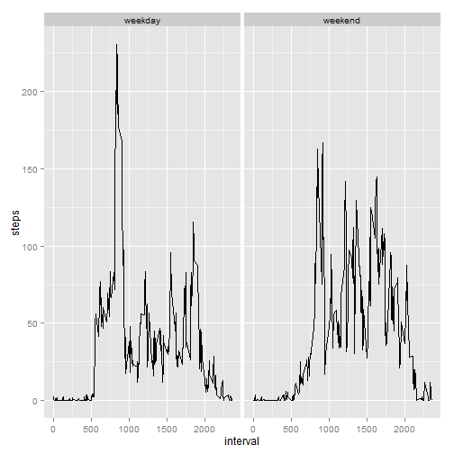

## Loading and preprocessing the data

1. Load the data

Convert the missing values to na at the same time.


```r
setwd("~/Coursera/Reproducible Research/Peer Assessment 1")
unzip("activity.zip")
data <- read.csv("activity.csv"
                 ,header=TRUE
                 ,nrows=17586
                 ,comment.char=""
                 ,na.strings="NA"
                )
```

## What is mean total number of steps taken per day?

1. Calculate the total number of steps taken per day


```r
stepsperday <- with(data,aggregate(steps~date,FUN=sum))
```

2. Make a histogram of the total number of steps taken each day


```r
hist(stepsperday$steps)
```

 

3. Calculate and report the mean and median of the total number of steps taken per day


```r
stepsmean <- mean(stepsperday$steps)
stepsmedian <- median(stepsperday$steps)
```

The mean number of steps per day is **10766.19**  
The median number of steps per day is **10765**

## What is the average daily activity pattern?

1. Time series plot of the 5-minute interval and the average number of steps taken


```r
meanperinterval <- with(data,aggregate(steps~interval,FUN=mean))
with(meanperinterval,plot(interval,steps,type="l"))
```

 

2. Which 5-minute interval contains the maximum number of steps?


```r
maxaverage <- max(meanperinterval$steps,na.rm=TRUE)
maxinterval <- meanperinterval[meanperinterval$steps==maxaverage,c("interval")]
```

The interval with the maximum average number of steps is interval **835**  

## Imputing missing values

1. Calculate and report the total number of missing values in the dataset


```r
missingdata <- is.na(data$steps)
count_of_missingdata <- sum(missingdata)
```

The data is missing the number of steps for **2304** records.

2. Devise a strategy for filling in all of the missing values in the dataset.

Where data is missing we will use the mean value for that 5-minute period
across the entire dataset.

3. Create a new dataset with the missing data filled in.


```r
data2 <- merge(data,meanperinterval,by=c("interval"))
missingsteps <- is.na(data2$steps.x)
data2$steps.x[missingsteps] <- data2[missingsteps,c("steps.y")]
data2 <- data2[,c("steps.x","date","interval")]
colnames(data2) <- c("steps","date","interval")
data2 <- data2[order(data2$date,data2$interval),]
```

4.  Make a histogram of the total number of steps taken each day and Calculate and 
report the mean and median total number of steps taken per day


```r
stepsperday2 <- with(data2,aggregate(steps~date,FUN=sum))
hist(stepsperday2$steps)
```

 

```r
stepsmean2 <- mean(stepsperday2$steps)
stepsmedian2 <- median(stepsperday2$steps)
```

When the missing values are imputed the mean number of steps per day is **10766.19**  
and the median number of steps per day is **10766.19**

Imputing the data has had no effect on the mean, but the median has increased slightly
and is now the same value as the mean.

## Are there differences in activity patterns between weekdays and weekends?

1. Create a new factor variable in the dataset with two levels - "weekday" and "weekend"


```r
data2$dow <- weekdays(as.Date(data2$date,"%Y-%m-%d"),TRUE)
data2$weekpart[data2$dow %in% c("Sat","Sun")] <- "weekend"
data2$weekpart[is.na(data2$weekpart)] <- "weekday"
```

2. Make a panel plot containing a time series plot of the 5-minute interval 
and the average number of steps taken, averaged across all weekday days or weekend days 


```r
meanperintervalperweekpart <- with(data2,aggregate(steps~interval+weekpart,FUN=mean))
library(ggplot2)
qplot(interval,steps,data=meanperintervalperweekpart,
           facets=.~weekpart, geom="line") 
```

 
